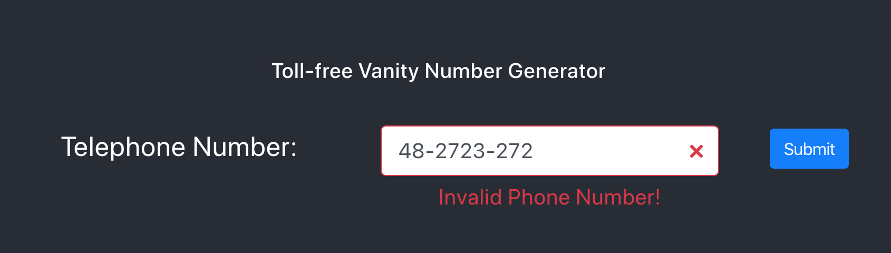

## Vanity Number Frontend

Frontend implemented using React.js demonstrating functionalities related to [Vanity Number](https://github.com/sreenivasanac/vanitynumber)

See Demo [https://vanitynumber-frontend.herokuapp.com/](https://vanitynumber-frontend.herokuapp.com/)

Python Module
[https://pypi.org/project/vanitynumber/](https://pypi.org/project/vanitynumber/)

Backend API (in Flask)
[https://vanitynumber-backend-api.herokuapp.com/](https://vanitynumber-backend-api.herokuapp.com/)

Backend API (in Flask) Github Repo
https://github.com/sreenivasanac/vanitynumber-backend-api

#### Installation
`react-scripts start`

Runs the app in the development mode. 
Open [http://localhost:3000](http://localhost:3000) to view it in the browser.

#### Testing
`react-scripts test`

Launches the test runner in the interactive watch mode. 
See the section about [running tests](https://facebook.github.io/create-react-app/docs/running-tests) for more information.

#### Deployment
`git push origin master`

This Repo is hooked with Heroku on every Git push, it is deployed.
